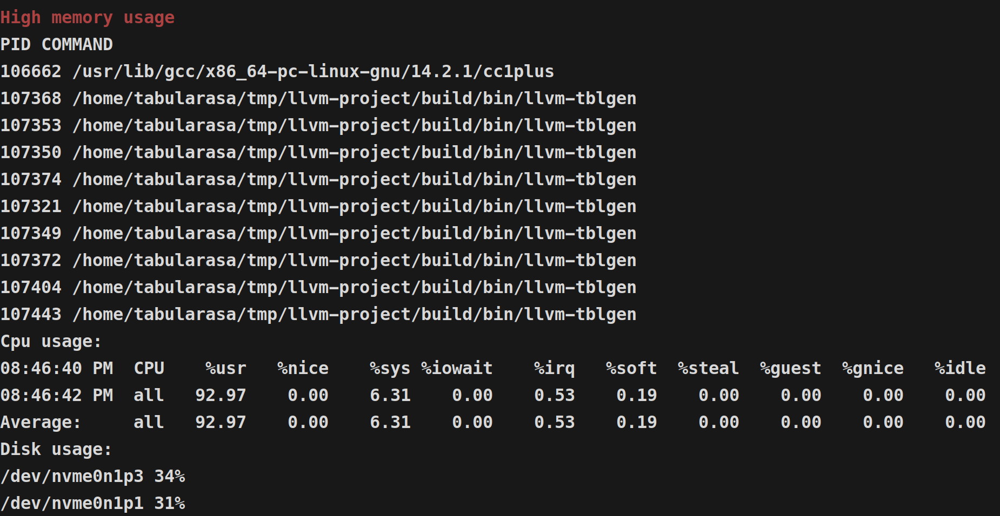
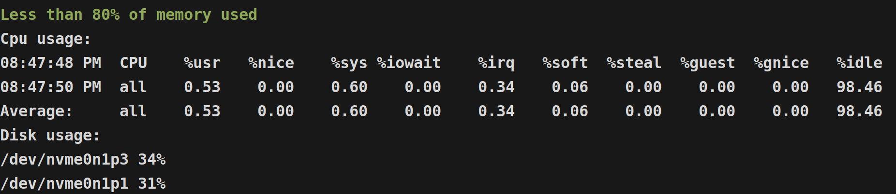

### Как тестировал
Для теста использовал сборку llvm в Debug режиме(так потребляется больше памяти):  
*git clone --depth 1 https://github.com/llvm/llvm-project.git*  
*cd llvm-project/*  
*cmake -S llvm -B build -G Ninja -DCMAKE_BUILD_TYPE=Debug*  
*ninja -C build*  

##### Примеры использования
  
  

P.S. для использования и теста нужны следующие пакеты:  
- ninja  
- mpstat (sysstat)  
